<div align="center">

# 📓 NOTRA

**An AI-powered, block-based note-taking application with real-time collaboration.**

NOTRA helps users capture, organize, and understand their notes with AI assistance.
Users work in personal or team workspaces, write structured block-based notes,
and interact with an AI assistant that can summarize, rewrite, explain, and
semantically search across their entire knowledge base.

</div>

---

## ✨ Key Features

| Feature | Description |
|---|---|
| **Block-based editor** | Notion-style blocks: text, headings (H1–H3), bullet lists, to-dos, code, quotes, callouts, dividers |
| **Slash command menu** | Type `/` in the editor to instantly insert any block type |
| **Workspaces** | Personal and team workspaces with role-based access (admin / editor / viewer) |
| **JWT Authentication** | Secure registration, login, and protected routes using JSON Web Tokens |
| **AI Chat Assistant** | Multi-turn conversation powered by Google Gemini 2.0 Flash with note context injection |
| **AI Actions** | Summarize, explain, bullet-point, fix grammar, improve, shorten, lengthen, translate, generate study questions |
| **Semantic Search** | Vector-based search using OpenAI `text-embedding-3-small` embeddings; falls back to a built-in TF cosine-similarity engine when no key is provided |
| **Voice-to-Text** | Record audio and transcribe using OpenAI Whisper (`whisper-1`) |
| **OCR** | Upload an image → Tesseract.js extracts text → Gemini cleans the result |
| **Real-time Collaboration** | Live cursor positions and note-change broadcasting via Socket.IO rooms |
| **Activity Streak Tracking** | Per-user daily streak (current and longest) tracked on the User model |
| **Favorites & Pinning** | Mark notes as favorites or pin them for quick access |

---

## 🛠 Tech Stack

### Frontend
| Technology | Purpose |
|---|---|
| React 19 | UI framework |
| React Router v7 | Client-side routing |
| Axios | HTTP client with JWT interceptors |
| Zustand | Lightweight global state management |
| Tailwind CSS v4 | Utility-first styling |
| Framer Motion | Animations |
| Socket.IO Client | Real-time collaboration |
| Lucide React / React Icons | Icon libraries |
| Vite | Dev server and bundler |

### Backend
| Technology | Purpose |
|---|---|
| Node.js + Express | REST API server |
| MongoDB + Mongoose | Database and ODM |
| JWT (`jsonwebtoken`) | Stateless authentication tokens |
| bcryptjs | Password hashing (salt rounds: 12) |
| Socket.IO | WebSocket layer for real-time collaboration |
| Multer | Multipart file uploads (audio + image, up to 25 MB) |
| Winston | Structured server-side logging |
| dotenv | Environment variable loading |

### AI & ML
| Technology | Purpose |
|---|---|
| Google Gemini 2.0 Flash (`@google/generative-ai`) | Chat assistant + AI text actions |
| OpenAI `text-embedding-3-small` (`openai`) | Semantic note search via 1536-dim embeddings |
| OpenAI Whisper (`whisper-1`) | Voice-to-text transcription |
| Tesseract.js | On-server OCR for image-to-text extraction |
| Built-in TF cosine similarity | Embedding fallback (no external key required) |

---

## 🏗 Architecture

```mermaid
flowchart TD
    User["👤 User (Browser)"]
    subgraph Frontend["React Frontend (Vite · port 5173)"]
        Pages["Pages\nLanding · Login · Dashboard · Workspace"]
        Stores["Zustand Stores\nAuth · Notes · Workspace · UI"]
        Services["Axios Services\nAPI · Auth · Notes · Workspace · AI"]
        SocketClient["Socket.IO Client\nuseSocket hook"]
    end
    subgraph Backend["Node.js + Express (port 5000)"]
        Routes["REST Routes\n/api/auth · /api/notes · /api/workspaces · /api/ai"]
        AuthMW["JWT Auth Middleware"]
        Controllers["Controllers\nAuth · Notes · Workspace · AI"]
        subgraph AILayer["AI Layer"]
            Gemini["Gemini 2.0 Flash\nChat + Actions"]
            Embedding["Embedding Service\nOpenAI / Built-in fallback"]
            Whisper["Voice Service\nOpenAI Whisper"]
            OCR["OCR Service\nTesseract.js"]
        end
        SocketServer["Socket.IO Server\nCollaboration rooms"]
    end
    DB[("MongoDB Atlas\nUsers · Notes · Workspaces · ChatHistory")]

    User --> Pages
    Pages --> Services
    Services -->|"HTTP + Bearer JWT"| Routes
    Routes --> AuthMW --> Controllers
    Controllers --> AILayer
    Controllers --> DB
    Pages --> SocketClient
    SocketClient <-->|"WebSocket"| SocketServer
    SocketServer --> Controllers
```



---

## 🔄 Application Workflow

```
User action (browser)
  └─▶ React component / Zustand store dispatch
        └─▶ Axios service call  →  POST /api/<resource>
              └─▶ Express router
                    └─▶ JWT authMiddleware  (verifies Bearer token)
                          └─▶ Controller function
                                ├─▶ Mongoose query  →  MongoDB Atlas
                                ├─▶ AI Service (Gemini / Whisper / Tesseract)
                                └─▶ JSON response  →  React state update

Real-time (Socket.IO):
  Collaborator A  ──▶  note-change event  ──▶  Socket.IO room
                                                      └─▶  Collaborator B receives note-updated
```

---

## 📁 Project Structure

```
NOTRA/
├── client/                    # React frontend (Vite)
│   ├── public/                # Static assets (favicon, icons)
│   └── src/
│       ├── assets/            # Images
│       ├── components/
│       │   ├── ai/            # AIChatPanel, VoiceRecorder
│       │   ├── editor/        # NoteEditor, EditorBlock, SlashCommand
│       │   ├── layout/        # MainLayout, Navbar, Sidebar, RightPanel
│       │   └── ui/            # Badge, Button, Card, Dropdown, Input, Modal, Tooltip, Loader
│       ├── hooks/             # useDebounce, useLocalStorage, useSocket
│       ├── pages/             # LandingPage, LoginPage, DashboardPage, WorkspacePage
│       ├── services/          # api.js (Axios), aiService, authService, notesService, workspaceService
│       ├── stores/            # useAuthStore, useNoteStore, useWorkspaceStore, useUIStore
│       └── utils/             # constants.js (block types, AI actions, slash commands)
│
├── server/                    # Node.js + Express backend
│   ├── config/                # db.js (MongoDB connection)
│   ├── controllers/           # authController, notesController, workspaceController, aiController
│   ├── middleware/            # authMiddleware (JWT), errorHandler, multer
│   ├── models/                # User, Note, Workspace, ChatHistory (Mongoose schemas)
│   ├── routes/                # authRoutes, notesRoutes, workspaceRoutes, aiRoutes
│   ├── services/              # openaiService (Gemini), embeddingService, ocrService, voiceService
│   ├── sockets/               # collaborationSocket.js (Socket.IO rooms + cursors)
│   ├── utils/                 # logger.js (Winston)
│   ├── app.js                 # Express app setup + route registration
│   └── server.js              # HTTP server entry point + Socket.IO init
│
├── shared/                    # Shared constants (block types, AI actions, workspace types)
│
├── .env.example               # Environment variable template (never commit .env)
├── .gitignore
└── package.json               # Root scripts: dev, server, client, install-all
```

---

## 🚀 Getting Started

### Prerequisites

- **Node.js** ≥ 18
- **npm** ≥ 9
- A **MongoDB** instance (MongoDB Atlas free tier works)
- A **Google Gemini API key** (free at [aistudio.google.com](https://aistudio.google.com/app/apikey)) — optional, app runs in demo mode without it
- An **OpenAI API key** — optional; required only for Whisper voice transcription and OpenAI-based embeddings

### Installation

```bash
# 1. Clone the repository
git clone https://github.com/<your-username>/AI-powered-Note-Taking-Application.git
cd AI-powered-Note-Taking-Application

# 2. Install all dependencies (root + server + client)
npm run install-all
```

### Environment Variables

```bash
# Copy the template
cp .env.example .env

# Fill in your values in .env
# (see .env.example for descriptions of each variable)
```

Required variables:

| Variable | Required | Description |
|---|---|---|
| `MONGODB_URL` | ✅ | MongoDB Atlas connection string |
| `JWT_SECRET` | ✅ | Any long, random string |
| `GEMINI_API_KEY` | ⚡ Optional | Gemini AI features (app works in demo mode without it) |
| `OPENAI_API_KEY` | ⚡ Optional | Whisper transcription + OpenAI embeddings |
| `PORT` | ⚡ Optional | Server port (default `5000`) |
| `CLIENT_URL` | ⚡ Optional | Frontend origin for CORS (default `http://localhost:5173`) |

### Running the Application

```bash
# Run backend + frontend concurrently (recommended)
npm run dev

# Or run separately:
npm run server   # Express server on :5000
npm run client   # Vite dev server on :5173
```

The Vite dev server proxies `/api` requests to the backend automatically — no separate CORS configuration needed for local development.

### Database

NOTRA connects to MongoDB via the `MONGODB_URL` environment variable.
A **MongoDB Atlas** free-tier cluster is sufficient. No manual schema setup is needed — Mongoose creates collections automatically on first use.

---

## 🔑 Key Design Decisions

- **Block-based data model**: Each note's `content` is stored as an array of typed blocks (`{ id, type, content, ... }`), mirroring the Notion-style block architecture.
- **Dual embedding strategy**: When an OpenAI key is present, `text-embedding-3-small` (1536 dimensions) is used for high-quality semantic search. Without a key, a lightweight built-in TF-based cosine similarity engine is used as a zero-dependency fallback.
- **AI demo mode**: All AI features degrade gracefully — without API keys, the app displays pre-defined demo responses so the UI remains fully navigable.
- **Stateless auth**: JWTs are stored in `localStorage` and attached via Axios request interceptors. The `authMiddleware` verifies them on every protected route.
- **Socket.IO rooms**: Each note editing session maps to a Socket.IO room (`note:<noteId>`). Cursor positions and content changes are broadcast to all other connected editors.


---

